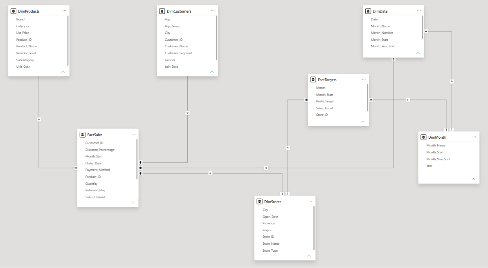
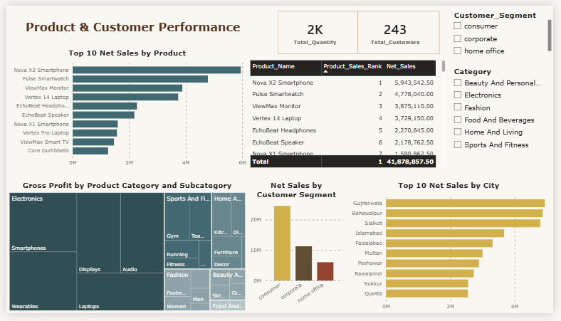
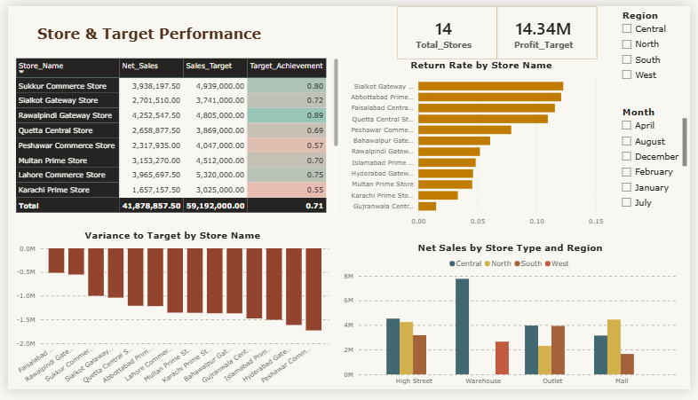

# Retail Performance & Target Analytics Dashboard

A Power BI project analyzing sales, profitability, customer behavior, store performance, and target achievement for a Pakistan-based retail chain. Built from messy raw transactional data through a full ETL pipeline into a star-schema model with 19 custom DAX measures and a three-page executive dashboard.

**Author:** Ramalah Amir

---

## 📊 Project Overview

This project simulates a real-world retail analytics engagement: take messy, inconsistent source data, clean and model it properly, and deliver a dashboard that lets management answer five core questions:

- How much are we selling?
- Are we profitable?
- Which products, customers, stores, and channels perform best?
- Are we meeting monthly targets?
- Where do returns create risk?

The raw data was intentionally messy (inconsistent date formats, mixed currency notation, duplicate records, inconsistent text casing) to mirror real operational data rather than a clean training dataset.

---

## 🗂️ Repository Contents

| File | Description |
|---|---|
| `PowerBI_Retail_Analytics_Project.pbix` | The full Power BI file — data model, all DAX measures, and the three-page dashboard |
| `Retail_Analytics_Project_Report.docx` | Written report covering dataset introduction, cleaning steps, model design, DAX measures, conditional formatting, and business insights/recommendations |
| `PowerBI_Retail_Analytics_Project.xlsx` | Raw source workbook (five messy worksheets) before cleaning |
| `screenshots/` | Dashboard page exports (see below) |

---

## 🏗️ Data Model

Built as a star schema with two fact tables and five dimension tables. Relationships are single-direction (dimensions filter facts) — no bidirectional relationships and no direct link between the two fact tables.

| Table | Type | Grain |
|---|---|---|
| `FactSales` | Fact | One row per sales transaction |
| `FactTargets` | Fact | One row per store, per month |
| `DimCustomer` | Dimension | One row per customer |
| `DimProduct` | Dimension | One row per product |
| `DimStore` | Dimension | One row per store |
| `DimDate` | Dimension | One row per calendar date (marked as the model's date table) |
| `DimMonth` | Dimension | One row per calendar month — bridges `FactSales` and `FactTargets` for actual-vs-target comparisons without a fact-to-fact relationship |

**Why the `DimMonth` bridge matters:** `FactSales` is daily-grain while `FactTargets` is monthly-grain. Linking them directly would violate the star schema and risk double-counting, so both facts connect to a shared `DimMonth` dimension instead.



---

## 🧮 Key DAX Measures

19 measures were built in a dedicated `_Measures` table, all using `DIVIDE()` for safe ratio calculations and no hardcoded totals — every measure recalculates correctly at any level of the model (grand total, region, store, product, or month).

```dax
Net_Sales = [Gross_Sales] - [Discount_Amount]
Gross_Profit = [Net_Sales] - [Total_Cost]
Target_Achievement = DIVIDE([Net_Sales], [Sales_Target])
Return_Rate = DIVIDE([Returned_Transactions], [Total_Orders])
YoY_Sales_Growth = DIVIDE([Net_Sales] - [Sales_LY], [Sales_LY])

Product_Sales_Rank =
RANKX(
    ALL(DimProducts),
    CALCULATE([Net_Sales]),
    ,
    DESC,
    DENSE
)
```

Full list and business definitions for all 19 measures are documented in the project report.

---

## 📈 Dashboard

Three pages, all sharing a consistent color theme, PKR currency formatting, and synchronized slicers for Region, Month, Sales Channel, and Category.

### Page 1 — Executive Overview
KPI strip (Net Sales, Gross Profit, Profit Margin, Sales Target, Target Achievement, Return Rate), channel split, regional summary table, and a monthly actual-vs-target trend.


### Page 2 — Product & Customer Performance
Top products by Net Sales, category/subcategory profit treemap, customer segment breakdown, and top cities by sales.



### Page 3 — Store & Target Performance
Store-level target achievement with conditional formatting, return rate by store, variance-to-target, and store type/region comparison.



---

## 🔑 Key Insights

- **Regional concentration:** Central region drives 46.4% of total Net Sales ($19.42M of $41.88M) — 7.3× the smallest region, West ($2.66M) — but runs the *lowest* profit margin (33%) of any region, while lower-volume North and South both run 35%.
- **Underperforming flagship markets:** Karachi and Lahore — Pakistan's two largest cities — don't appear in the Top 10 cities by sales, and their named stores confirm it: Karachi Prime Store posts the lowest Target Achievement in the dataset (55%).
- **Product concentration risk:** the top 3 products account for ~34.9% of total Net Sales; Nova X2 Smartphone outsells its own sibling product, Nova X1, by 3.7×.
- **Consumer-led business:** the Consumer segment clearly outweighs Corporate and Home Office combined.
- **Balanced channels:** Online (51.25%) and In-Store (48.75%) are close to evenly split.
- **Universal target shortfall, uneven severity:** every visible store is under target, but the gap ranges from ~$552K (Rawalpindi Gateway, 89% achievement) to over $1.7M (Peshawar Commerce, 57% achievement).

Full insights and recommendations are in the project report.

---

## 🛠️ Tools Used

- **Power BI Desktop** — data modeling, Power Query transformations, DAX, dashboard design
- **Power Query** — cleaning, de-duplication, type casting, and standardization of five raw source tables
- **DAX** — 19 custom measures plus calculated columns for segmentation and report-friendly sorting

---

## 📂 How to Use This Project

1. Download `PowerBI_Retail_Analytics_Project.pbix` and open it in Power BI Desktop.
2. Explore the Model view to see the full star-schema relationship map.
3. Use the slicers on each dashboard page (Region, Month, Sales Channel, Category) to filter the analysis interactively.
4. Refer to `Retail_Analytics_Project_Report.docx` for the full write-up of cleaning steps, modeling decisions, and business insights.
